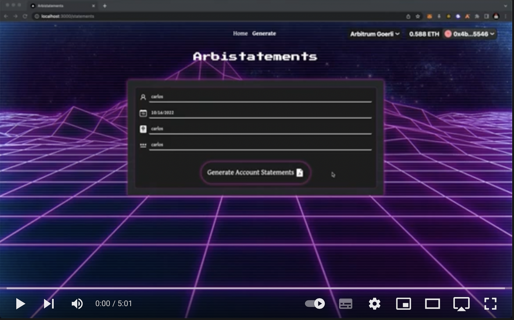

# **Arbistatements** - Arbitrum Hackathon, Bogota.
## What is Arbistatements ? 
Arbistatements lets you create Crypto statments using ZK without revealing your identity on those statements. It is powered by the semaphore , which uses Zero Knowledge to prove that users are part of a group and send signals anonymously. The Protocol receives funds from users who want to generate **Arbistatements**, and these funds are invested in lending platforms such as aave. 
## How it works ?
- Users join our protocol by paying a small fee , one per address.
- Users link each address to their identity commitment
- Identity commitments are composed of Name + Birthdate + **Password** + Passport Number
- Users are able to generate **Arbistatements** by paying a fee and proviving they know the right identity commitments.
- A pdf is generated with the user Name on it and his Passport number, **no account address is revealed**

## Inspiration ?
The need to generate Crypto statements without writting your address in the document, by just providing the list of assets held by address and some of the previous transactions, without telling the bank or third party entity what is your address, thus avoiding further tracking.

## Demo Video
[](https://youtu.be/8bmmw0kWkgk)
## Pitch Deck
https://pitch.com/public/757feea8-bf0e-4374-b77b-4630aa23df6a
## Stack
- Solidity Hardhat (using [semaphore](https://github.com/semaphore-protocol/boilerplate) contracts as base / starting point)
- Next Js ( frontend )
- Express ( backend aka relay )
## POC - Deployed contracts - Arbitrum Goerli
```bash
Verifier20 contract has been deployed to: 0x6236688C0D0A4483747ce8777986621aE191e9e2
Poseidon library has been deployed to: 0xF778926180dB7909e907BF3B14134D0e1ebCC69d
IncrementalBinaryTree library has been deployed to: 0xb8e86A4c40e0307B389AeFC2be1E5048A611Db13
Semaphore contract has been deployed to: 0x2686540BE833cFB49F1D8BEa13F7c0E46767FC2D

//main contract here :
Arbistatements contract has been deployed to: 0xe9F49bE29195AFa0BDB483561D547C36f8be5045
```